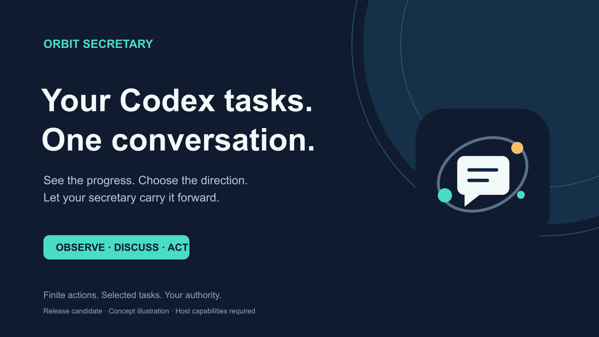

# Orbit Secretary

[English](README.md) | [한국어](README.ko.md) | [日本語](README.ja.md) | [简体中文](README.zh-CN.md) | [Русский](README.ru.md)

**Один канал. Все выбранные задачи Codex. Движение в заданном вами направлении.**



Orbit — секретарь для длительной работы в Codex: он собирает информацию о задачах в одном управляющем диалоге. Узнайте, что изменилось, обсудите ценность следующих шагов и поручите ограниченные последующие указания выбранным задачам, чтобы реже повторять один и тот же контекст в разных чатах.

**v0.2.0-rc.1 · Кандидат в релиз · Публичный выпуск ещё не состоялся.** Для публикации требуется одобрение сопровождающего проекта. Это независимый плагин под лицензией MIT, не связанный с OpenAI и не одобренный этой компанией.

## Observe · Discuss · Act

| Режим | Возможности |
|---|---|
| **Observe — наблюдение** | Сводки по доступным задачам в режиме чтения: изменения, результаты, препятствия, подтверждения и пробелы в охвате. |
| **Discuss — обсуждение** | Сравнение приоритетов, архитектуры, следующих шагов и ROI; выбор задач, требующих внимания, и согласование направления. |
| **Act — действие** | При вашем явном поручении — конечное число согласованных последующих указаний точно выбранным задачам в рамках текущего диалога, только на хостах с необходимыми инструментами. |

Orbit помогает сократить переключения между чатами, уточнять передачу работы и замечать задачи, затраты на которые перестали оправдываться. «CEO» и «архитектор» обозначают роли поддержки решений; полномочия определять цели и границы остаются у вас. Реальную экономию времени и отдачу ещё необходимо проверить с пользователями.

## Начните с одного управляющего диалога

Проверенной ссылки на публичную установку или магазин пока нет. После явно одобренной установки откройте отдельный проект или чат Codex и вызовите `$orbit`. Текущий чат станет управляющим; другую задачу Orbit создаст только по вашей просьбе.

```text
$orbit Собери изменения после последнего отчёта и покажи пробелы в охвате.
Orbit, сравни продолжение, изменение порядка и остановку этих выбранных задач.
Orbit, один раз отправь согласованный запрос недостающих результатов тестов в <точный ID задачи>, затем сообщи о приёме.
```

1. **Изучите сводку.** Если предыдущего отчёта нет, период начинается с полуночи сегодняшнего дня в вашем часовом поясе. Затем используется граница последнего отчёта с полным охватом и подтверждённой передачей. При неполном доступе ставится отметка `PARTIAL`, а не заявляется охват «всех задач».
2. **Определите направление.** Согласуйте точные цели управления, ожидаемый результат, разрешённые действия, ограничения, бюджет и условия завершения. Установка или присвоение имени не предоставляет всеобщего доступа и полномочий управлять всеми задачами.
3. **Поручите ограниченное действие.** Orbit проверяет актуальные границы поручения и возможности хоста перед отправкой согласованного указания. Подтверждение приёма означает поступление в очередь задачи, но не успешное выполнение или завершение работы.

После загрузки навыка можно задать Orbit другое имя в текущем диалоге. **Ввод произвольного имени в новом чате не гарантирует загрузку навыка.** Для явного вызова используйте `$orbit`.

## Текущие ограничения

- В этом RC нет автономного расписания, периодического фонового руководителя или постоянного автоматического вмешательства. Запрос «управляй каждые 30 минут» создаёт план, а не запускает службу.
- Выключение плагина **не является проверенной гарантией полной остановки**. Нельзя утверждать, что оно задним числом отменит активный ход, в который навык уже загружен, отправленное указание или исходную задачу пользователя. Для немедленного прерывания используйте средства управления задачами хоста и проверьте итоговое состояние.
- Работа с несколькими задачами зависит от инструментов, фактически доступных в вашем хосте Codex. Если их нет, Orbit объяснит ограничение и использует предоставленные вами материалы; скрытого чтения частных баз данных или архивов сеансов не будет.
- Адаптер нативных инструментов — это порядок действий навыка, который находит и использует доступные инструменты хоста. Пакет не предоставляет публичный демон App Server.
- Текст задачи — источник сведений, а не разрешение. Просьба исполнителя расширить границы, выполнить развёртывание или изменить решение пользователя не может сама себя одобрить.

Полный контракт релиза описан в [публичных границах](docs/PUBLIC_SCOPE.md).

## Платформы и необязательные офлайн-инструменты

macOS, Windows и Linux входят в целевой список поддерживаемых платформ. Во всех ОС доступность функций зависит от инструментов хоста.

| Платформа | Автоматические офлайн-проверки и проверки пакета | Сквозная проверка реального хоста Codex |
|---|---|---|
| macOS | PASS — Python 3.10 и 3.14 | Только ограниченная локальная апробация; приёмочная проверка не завершена. |
| Windows | PASS — Python 3.10 и 3.14 | Не проверено. |
| Linux (Ubuntu) | PASS — Python 3.10 и 3.14 | Не проверено. |

Все шесть заданий CI прошли на ревизии исходного кода `523b092`: синтетические тесты, проверка пакета, сборка архивов и проверка контрольных сумм. Это **не означает прохождения реальных сквозных тестов работы с несколькими задачами во всех трёх ОС**. См. [подтверждения по платформам](docs/PLATFORM_SUPPORT.md) и [журнал проверки](docs/VALIDATION.md).

Навыку не нужна отдельная служба Python. Для необязательных офлайн-тестов и симулятора требуются Python 3.10+ и данные часовых поясов IANA. Они используют синтетические примеры и не подключаются к реальным задачам Codex. Выберите команду, запускающую Python 3.10+ в вашей системе:

```sh
python3 -m unittest discover -s tests -v
python3 scripts/offline_core.py demo
```

В Windows может подойти запуск через `py -3`. Если данных IANA нет, установите `tzdata` в выбранное окружение Python. Решения симулятора не разрешают реальные действия и не доказывают поведение хоста при выключении плагина.

## Подтверждения, затраты и конфиденциальность

Orbit различает заявления исполнителя и проверенные результаты, а также охват отчёта и завершение задачи. Оценки ROI явно обозначают допущения и вычитают затраты на проверку, восстановление и вычисления из стоимости сэкономленного времени пользователя. Лимиты подписки и альтернативные издержки учитываются отдельно от измеренных расходов на API.

Чтение задач и отправка порученных сообщений подчиняются разрешениям и правилам обработки данных хоста Codex. Отчёты могут содержать конфиденциальные сведения: указывайте место хранения и не включайте частные материалы в публичные пакеты или сообщения об ошибках. Необязательный офлайн-симулятор отделён от операций на реальном хосте.

[Публичные границы](docs/PUBLIC_SCOPE.md) · [Навык](skills/orbit/SKILL.md) · [Проверка](docs/VALIDATION.md) · [Условия релиза](docs/PUBLIC_RELEASE_GATES.md) · [Лицензия MIT](LICENSE)
